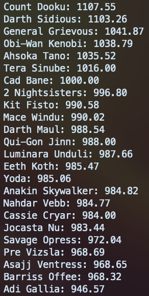

# Jedi/Sith Lightsaber duelist ELO ranking system

## Overview

This project was built to establish the best lightsaber duelists. Force powers are not taken into considerattion. See all records of duels used in the calcations [here](data.json).

> [!NOTE]
> Please be aware that the dataset used is not exhaustive, and some of the results (like a draw or tie) may be open to interpretation. Each object in the dataset has a `youtube` key which contains a link to the video of the duel. Some links may be used multiple times for different duels referencing different timestamps.

## Resources

The initial idea for this project came about upon reading a Reddit thread created by [u/Disciplined2021](u/Disciplined2021) discussing all lightsaber duels before the [fall of the republic](https://www.reddit.com/r/clonewars/comments/kv9joq/every_lightsaber_duel_before_the_fall_of_the/).

The same user also compiled a list of win-loss records for [these duels](https://www.reddit.com/r/clonewars/comments/kvbbfi/winloss_records_for_lightsaber_duelists/). This project builds on this approach and also includes the possibility of a "Draw".

## Get Started

- You'll need to install [Go](https://go.dev/doc/install).
- Clone the repository:
  ```bash
  git clone https://github.com/barrymun/jedi-sith-elo.git
  ```
- Change directory:
  ```bash
  cd jedi-sith-elo
  ```

## Usage

```bash
go run main.go 
```

## Screenshots

A screenshot of the expected results:



## Acknowledgements

A big thanks to [u/Disciplined2021](https://www.reddit.com/user/Disciplined2021/) for the initial work compiling the list of duels and results.

## License

This project is licensed under the MIT License. See the [LICENSE](LICENSE) file for details.
